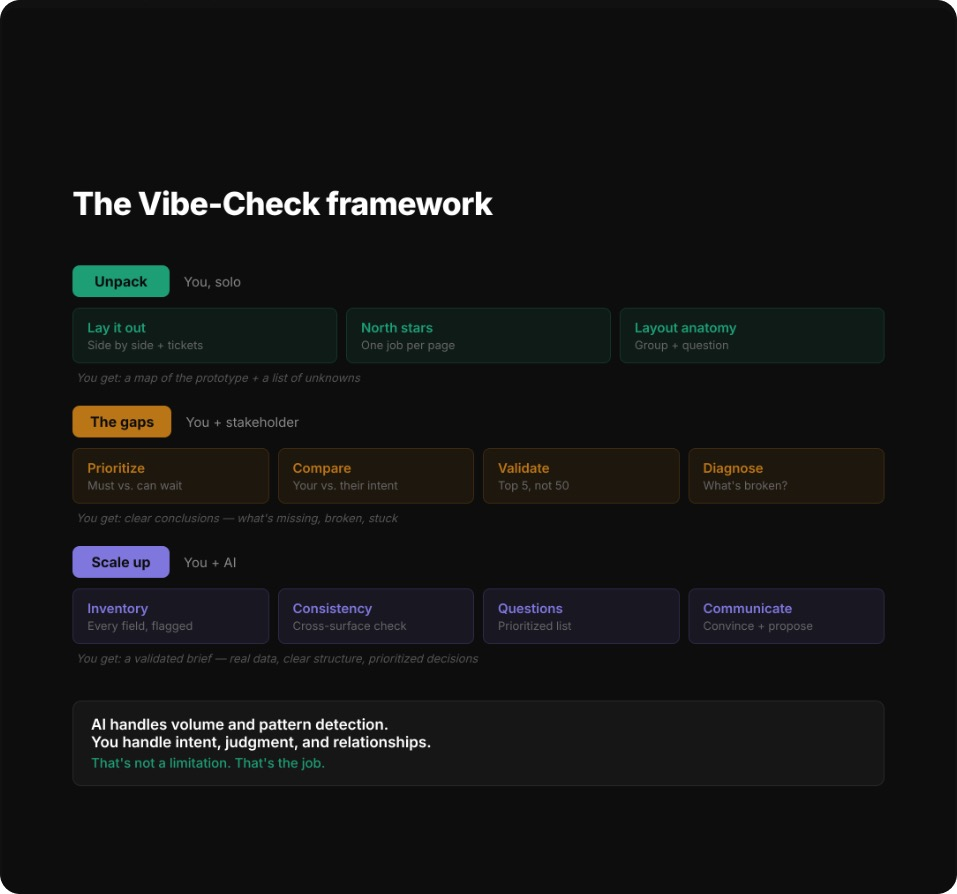
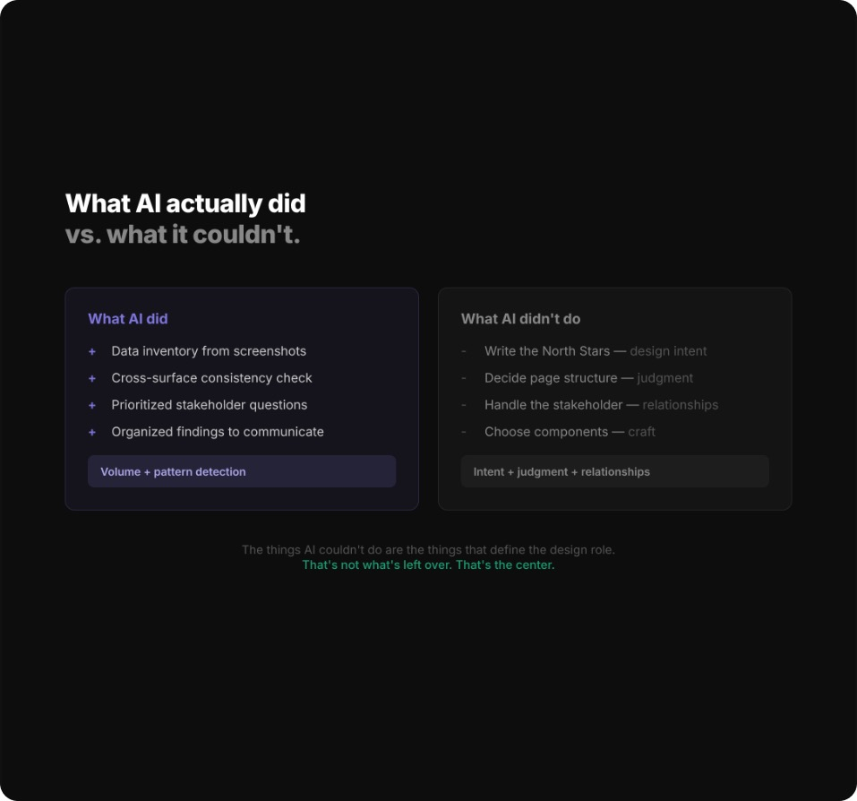

# Vibe-Check

> Separate real requirements from assumptions and AI filler **before** Figma — when a stakeholder vibe-codes a prototype and design is about to start.

**Framework:** [Vibe-Check (Marian Torrealba)](https://uxsidekick.substack.com/p/stop-designing-upon-what-the-pm-vibe)  
**Packaged from:** [Adonay Design OS](https://github.com/adonaylizardo/adonay-design-os) templates — portable agent skill, not the Design OS CLI.

---

## What this is

An **agent skill** (not an app, not a CLI) that produces a **Prototype Design Review** markdown document. Drop a vibe-coded prototype — Lovable, v0, Cursor, Bolt, Magic Patterns, HTML, screenshots, or a repo — into Cursor, Claude Code, or Codex and get a structured review **before** opening Figma or writing specs.

The prototype is **not a spec**. It is a **brief in disguise** — real requirements, stakeholder assumptions, and AI filler mixed together. This skill teaches the agent to separate those layers and review **intent**, not pixels.



---

## Who it's for

- **Product designers** receiving vibe-coded prototypes from PMs, founders, or clients
- **Design leads** gating MVP scope before Figma investment
- **Design mentors** running the same analysis without the full Design OS CLI
- **Anyone** preparing an alignment call with exactly five decisions that unblock design

---

## Problems it solves

- Stakeholders (or PMs) vibe-code a prototype and treat it as the spec; design starts copying AI chrome.
- Nobody knows what was **required** vs **assumed** vs **hallucinated** by the generator.
- Walkthroughs become taste debates instead of five decisions that unblock MVP.
- Field, label, and approval vocabulary drifts across screens.
- Designers skip straight to Figma and bake in the filler.

---

## Why use it

- **Gate before design** — Every UI block gets **Keep / Validate / Clarify / Out of scope** with cited sources. Never invented metrics.
- **Collaborative expert tone** — Not a roast. Stakeholder-facing prose uses the four verdicts above, not internal jargon.
- **Exactly five questions** — Each names a prototype element, states the gap, suggests a default, and maps to the design decision it unblocks.
- **Complements visual design review** — Does not replace one. Does **not** start Figma or rewrite the prototype.



---

## Use cases

1. **PM drops a Lovable/v0 link after a workshop** — Designer vibe-checks before any Figma file exists.
2. **Founder Cursor-coded an internal tool overnight** — Sort what to keep vs what is demo theater.
3. **Client shares an HTML/Tailwind click-dummy + Slack notes** — Produce the five questions for the alignment call.
4. **Design OS / mentoring** — Same analysis without running `design vibe-check` in the full OS.
5. **Compare two vibe-coded variants** — Still one review doc; flag which blocks are requirements vs filler in each.

---

## What you get

One markdown file: **`vibe-check-analysis.md`**

Written to `insights/` if that folder exists in your project; otherwise the current working directory.

Structure:

1. Title + short intro (complements, not replaces, a design review if present)
2. **SCQR** narrative (Situation, Complication, Question, Resolution)
3. **Part 1 — Walkthrough:** North Star per screen, layout anatomy, block-by-block Keep/Validate/Clarify/Out of scope
4. **Part 2 — Five questions** + conversation opener
5. **Part 3 — Field inventory**, cross-screen consistency, Keep / Remove / Redesign / Clarify
6. **Sources**

---

## Install

Clone this repository:

```bash
git clone https://github.com/adonaylizardo/vibe-check.git
cd vibe-check
```

Copy the **`vibe-check/`** skill folder (the directory that contains `SKILL.md`) to your agent's skills directory.

### Cursor

Project-level (share with the team):

```bash
mkdir -p .cursor/skills
cp -R ./vibe-check .cursor/skills/
```

User-level (all projects):

```bash
mkdir -p ~/.cursor/skills
cp -R ./vibe-check ~/.cursor/skills/
```

Cursor also discovers `.agents/skills/` (vendor-neutral). Either `.cursor/skills/` or `.agents/skills/` works.

**Invoke:**

```text
Use the vibe-check skill on this prototype: [URL or path]
Stakeholder notes: [paste notes]
Write the review in English.
```

Or type `/vibe-check` in Agent chat if the skill is discovered.

Skills appear under **Customize → Skills** in the Cursor sidebar.

### Claude Code

Project-level:

```bash
mkdir -p .claude/skills
cp -R ./vibe-check .claude/skills/
```

User-level:

```bash
mkdir -p ~/.claude/skills
cp -R ./vibe-check ~/.claude/skills/
```

**Invoke:**

```text
/vibe-check

Prototype: https://preview.lovable.app/...
Notes from workshop: [paste]
```

Or describe the task; Claude matches the skill from its description.

### Codex

```bash
mkdir -p "${CODEX_HOME:-$HOME/.codex}/skills"
cp -R ./vibe-check "${CODEX_HOME:-$HOME/.codex}/skills/"
```

**Invoke:**

```text
Use $vibe-check on this v0 prototype before I open Figma.

Prototype URL: ...
Stakeholder notes: ...
Output in Spanish.
```

---

## What to paste

Give the agent whatever you have:

| Input | Example |
|-------|---------|
| Prototype URL | Lovable, v0, Bolt, Magic Patterns, deployed preview |
| Local files | Path to `index.html`, repo root, or screenshot folder |
| Stakeholder notes | Workshop bullets, Slack thread, email, PRD excerpt |
| Existing design review | Optional — skill complements it, does not replace it |

**Language:** Ask for the review in the language of your audience (`Write in English` or `Escribe la revisión en español`). Do not mix languages in one document.

---

## Repository layout

```text
.
├── README.md
├── LICENSE
├── NOTICE.md
├── docs/
│   ├── framework.jpg
│   └── ai-did-vs-couldnt.jpg
└── vibe-check/
    ├── SKILL.md
    └── references/
        ├── framework.md
        ├── analysis-template.md
        └── examples.md
```

Install **`vibe-check/`** — not the repo root.

---

## Credits

| | |
|---|---|
| **Vibe-Check framework** | Marian Torrealba — [Stop Designing Upon What the PM Vibe-Coded](https://uxsidekick.substack.com/p/stop-designing-upon-what-the-pm-vibe) |
| **Skill packaging** | Adonay Lizardo — extracted from [Adonay Design OS](https://github.com/adonaylizardo/adonay-design-os) `.design-os/` templates |

Marian Torrealba created the framework. Adonay Lizardo packaged it as a portable agent skill. See [NOTICE.md](NOTICE.md).

---

## License

MIT License. See [LICENSE](LICENSE).
